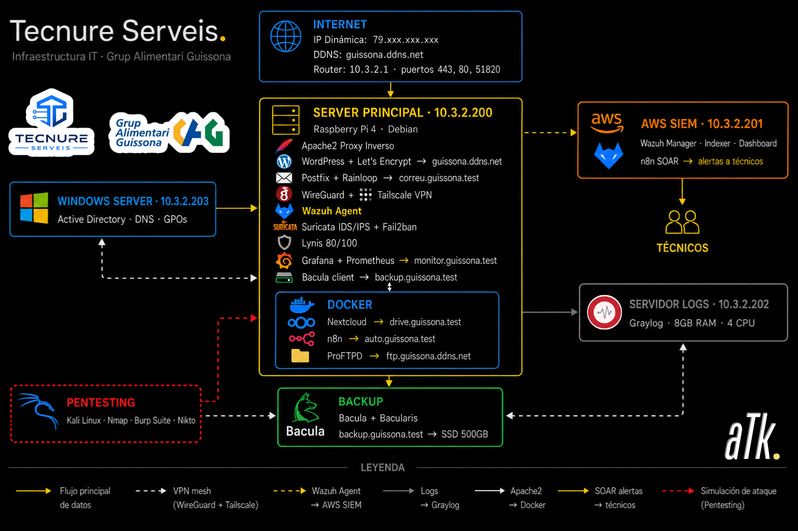
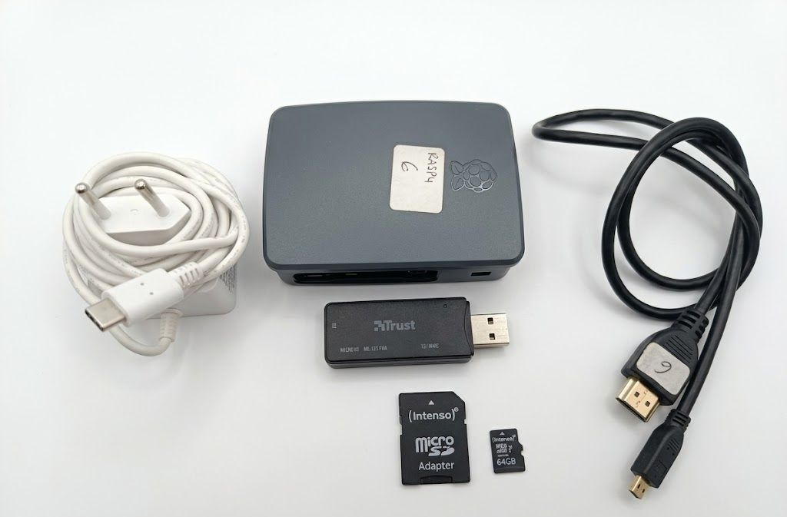

# 🖥️ Tecnure Serveis — Infraestructura TI para Grup Alimentari Guissona


> **Calificación final: 10/10** · SMR (Sistemas Microinformáticos y Redes) · IES Thos i Codina · Mataró · 2025–2026

---

## 📋 Descripción del proyecto

**Tecnure Serveis** es una consultora informática ficticia creada como proyecto final transversal de **2.º curso de SMR**. El proyecto consiste en la **implantación completa de un departamento de informática desde cero** para **Grup Alimentari Guissona**, una cooperativa agroalimentaria catalana con más de **4.300 empleados** y una facturación anual superior a **15 millones de euros**.

Tecnure Serveis actuó como proveedor tecnológico externo, asumiendo todas las funciones de un departamento de TI interno: diseño de redes, administración de servidores, ciberseguridad, automatización, monitorización y copias de seguridad.

---

## 👥 Equipo

| Miembro | Rol |
|---------|-----|
| **Amadou Traore Keita** | Responsable de Infraestructura, Sistemas, Seguridad y Automatización |
| **Willy Anthony Machuca Sierra** | Responsable de Sistemas Físicos, Redes y Diseño |

---
## 🖥️ Hardware


| Componente | Detalle |
|---|---|
| **Modelo** | Raspberry Pi 4 Model B |
| **Fabricante** | Raspberry Pi Foundation |
| **Año de fabricación** | 2018 |
| **Procesador** | ARM Cortex-A72, 4 núcleos a 1,5 GHz |
| **Memoria RAM** | 4 GB LPDDR4-2400 SDRAM |
| **Almacenamiento** | MicroSD de 64 GB |
| **Conectividad** | Ethernet Gigabit + Wi-Fi |
| **Sistema operativo** | Debian 12 (Bookworm) |
| **Arquitectura** | ARM64 (aarch64) |
| **Dirección IP interna** | 10.3.2.200/24 |
| **Ubicación** | Sala de servidores (nodo central) |
| **Función principal** | Servidor principal de la infraestructura |
## 🏗️ Arquitectura

```text
Internet (Fibra DIGI) — IP Pública: 79.xxx.xxx.xxx → guissona.ddns.net
         │
    Router / Firewall (10.3.2.1) — Puertos: 443, 80, 51820
         │
    ┌────┴────────────────────────────────┐
    │                                     │
server-guissona (10.3.2.200)         ad-server (10.3.2.203)
Raspberry Pi 4 · Debian              Windows Server
    │                                Active Directory + DNS
    ├── Apache2 Reverse Proxy
    ├── WordPress + Let's Encrypt → guissona.ddns.net
    ├── Postfix + Rainloop → correu.guissona.test
    ├── WireGuard VPN (puerto 51820)
    ├── Tailscale (VPN de contingencia)
    ├── Agente Wazuh ───────────────→ siem-guissona (10.3.2.201) AWS
    ├── Suricata IDS/IPS               Wazuh Manager + Indexer + Dashboard
    ├── Fail2ban                       n8n SOAR → Alertas a técnicos
    ├── Grafana + Prometheus → monitor.guissona.test
    ├── Cliente Bacula → backup.guissona.test → SSD 500 GB
    │
    └── DOCKER (3 servicios)      syslog-guissona (10.3.2.202)
        ├── Nextcloud → drive.guissona.test      Graylog · 8 GB RAM · 4 CPU
        ├── n8n → auto.guissona.test
        └── ProFTPD → sftp.guissona.test
```
---

## 🔧 Tecnologías

### Infraestructura y Red

- **Topología:** Estrella de estrellas
- **Servidor:** Raspberry Pi 4 (ARM Cortex-A72, 4 GB RAM, MicroSD de 64 GB)
- **Sistema operativo:** Debian 12 Bookworm
- **Red:** 10.3.2.0/24 · Switch TP-Link · Fibra DIGI
- **DDNS:** IP dinámica → `guissona.ddns.net`

### Servicios

| Servicio | Tecnología | URL | Entorno |
|----------|------------|-----|----------|
| Página web corporativa | WordPress | `guissona.ddns.net` | Público |
| Certificados SSL | Let's Encrypt | `guissona.ddns.net` | Público |
| Correo corporativo | Postfix + Rainloop | `correu.guissona.test` | Privado |
| Almacenamiento corporativo | Nextcloud | `drive.guissona.test` | Privado |
| FTP Seguro | ProFTPD | `sftp.guissona.test` | Privado |
| Monitorización | Grafana + Prometheus | `monitor.guissona.test` | Privado |
| Copias de seguridad | Bacula + Bacularis | `backup.guissona.test` | Privado |
| Automatización | n8n | `auto.guissona.test` | Privado |
| DNS Interno | BIND9 | Zonas `.test` | Interno |
| Reverse Proxy | Apache2 mod_proxy | Todos los subdominios | Interno |
| VPN Principal | WireGuard | Puerto 51820 | Interno |
| VPN de Respaldo | Tailscale | Contingencia | Interno |

---

## 🔒 Ciberseguridad — SOC

| Capa | Herramienta | Función |
|------|-------------|----------|
| **SIEM** | Wazuh (Agente → AWS) | Detección y respuesta ante incidentes en tiempo real |
| **IDS/IPS** | Suricata | Análisis del tráfico de red y detección de intrusiones |
| **IPS** | Fail2ban | Bloqueo automático de ataques por fuerza bruta |
| **SOAR** | n8n | Automatización de alertas y envío de resúmenes a técnicos |
| **Auditoría** | Lynis | Auditoría de hardening del sistema (**80/100**) |
| **Pentesting** | Kali Linux | Pruebas internas de penetración (Nmap, Burp Suite y Nikto) |
| **Cifrado** | SSL/TLS Let's Encrypt | Todas las comunicaciones cifradas |

> 💡 **Arquitectura distribuida de Wazuh:** el agente se ejecuta en la Raspberry Pi y envía todos los eventos al servidor Wazuh alojado en **AWS EC2 (10.3.2.201)**, permitiendo monitorización en tiempo real, alertas y un panel centralizado.

---

## 📊 Monitorización y Registros

| Herramienta | Función |
|-------------|----------|
| Grafana | Paneles visuales de métricas del sistema |
| Prometheus | Motor de recopilación de métricas |
| Graylog | Centralización de registros de TODOS los servidores (servidor dedicado 10.3.2.202) |
| Wireshark | Análisis forense del tráfico de red |

---

## 💾 Copias de Seguridad

- **Bacula + Bacularis:** copias de seguridad empresariales (completas e incrementales).
- **Almacenamiento:** SSD externo de 500 GB (NAS).
- **Programación:** copias automáticas diarias y semanales.

---


## 📊 Resultados Obtenidos

- ✅ **Puntuación de hardening con Lynis: 80/100**
- ✅ SOC completo: Suricata + Wazuh + n8n SOAR (alertas automáticas a técnicos)
- ✅ Arquitectura distribuida de Wazuh: agente local + servidor AWS
- ✅ HTTPS en todos los servicios mediante Let's Encrypt y Apache2 Reverse Proxy
- ✅ VPN redundante: WireGuard (principal) + Tailscale (contingencia)
- ✅ Copias de seguridad automáticas diarias y semanales con Bacula sobre SSD NAS
- ✅ Monitorización 24/7 mediante Grafana, Prometheus y Graylog

---


## 🎓 Contexto Académico

- **Ciclo Formativo:** Sistemas Microinformáticos y Redes (SMR) — 2.º curso
- **Centro:** IES Thos i Codina · Mataró
- **Curso académico:** 2025–2026
- **Calificación:** **10/10 ✨**
- **Autores:** Amadou Traore Keita y Willy Anthony Machuca Sierra

