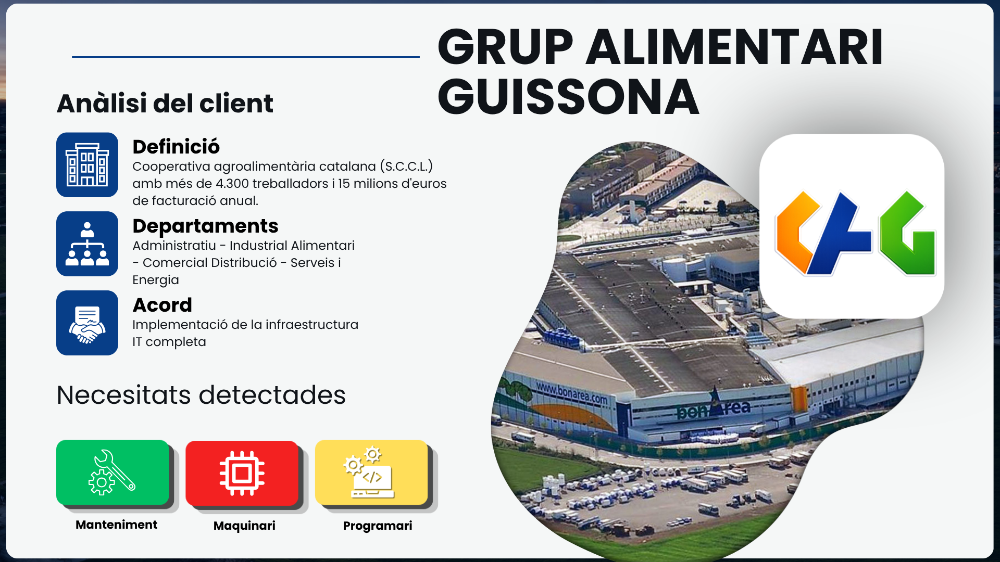
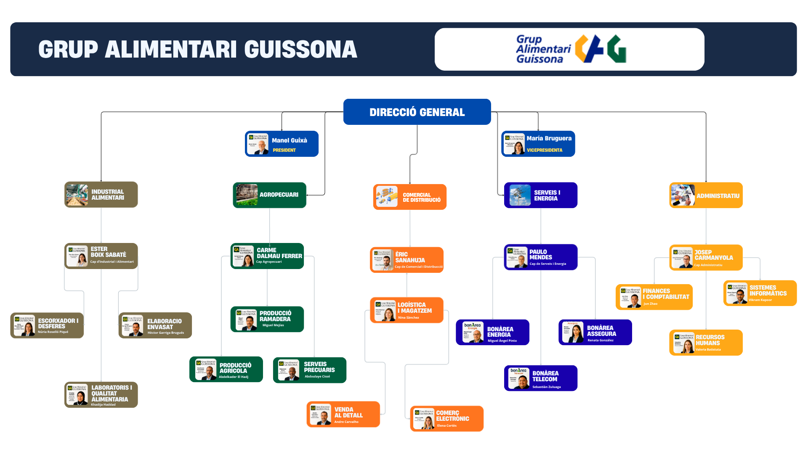

# 🏭 Grup Alimentari Guissona

## Sobre la empresa

El **Grup Alimentari Guissona** es una empresa privada del sector ramadero y de la industria alimentaria, con forma jurídica de **Societat Cooperativa Catalana Limitada (S.C.C.L.)**.

| Dato | Detalle |
|---|---|
| **Sector** | Ramadero / Industria alimentaria |
| **Forma jurídica** | Sociedad Cooperativa Catalana Limitada (S.C.C.L.) |
| **Plantilla** | Más de 4.300 trabajadores |
| **Facturación anual** | +15 millones de euros |
| **Ámbito de actuación** | Nacional (España) |
| **Marca comercial** | bonÀrea |

## Actividad

El Grup Alimentari Guissona gestiona de manera integral toda la cadena de valor del sector agroalimentario: desde la producción ganadera y agrícola, hasta la transformación industrial, la distribución comercial y la venta al detalle.

A través de su marca **bonÀrea**, ofrece productos cárnicos, alimentarios y servicios complementarios como energía, seguros y telecomunicaciones.

## Estructura organizativa

La empresa se divide en seis grandes departamentos:

| Departamento | Funciones principales |
|---|---|
| **Dirección General** | Representación de la empresa, toma de decisiones, coordinación de departamentos, supervisión de cumplimiento legal |
| **Agropecuario** | Producción ganadera y agrícola, servicios pecuarios, planificación de cultivos |
| **Industrial Alimentario** | Coordinación de matadero, elaboración y envasado, laboratorios y calidad alimentaria |
| **Comercial de Distribución** | Logística y almacenes, venta al detalle, comercio electrónico |
| **Servicios y Energía** | Coordinación de bonÀrea Energía, Seguros y Telecom, gestión de residuos energéticos |
| **Administrativo** | Finanzas y contabilidad, RRHH, sistemas informáticos |

## Necesidad tecnológica

Dado el volumen de actividad, la complejidad operativa y el tamaño de la plantilla, el Grup Alimentari Guissona requiere una infraestructura tecnológica robusta, segura y escalable que garantice la continuidad del negocio y la integridad de sus datos en todo momento.

## El acuerdo con Tecnure Serveis

**Tecnure Serveis** actúa como proveedor tecnológico externo, implementando el departamento IT del Grup Alimentari Guissona desde cero y asumiendo todas las funciones de un departamento IT interno.

- **Duración de la implementación:** máximo 3 meses (01/06/2026 – 01/09/2026)
- **Metodología:** implementación por fases, con validación al final de cada una
- **Mantenimiento ofrecido:** preventivo, predictivo, servicio 24x7 y formación para empleados

---

*Cliente ficticio del proyecto final [tecnure-serveis](../README.md), desarrollado como proyecto intermodular de 2.º curso de SMR.*