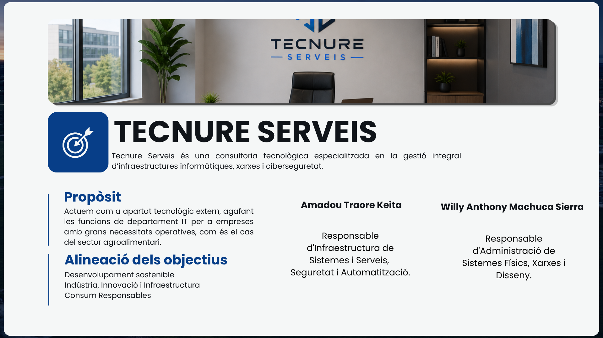

# 🖥️ Tecnure Serveis

## Sobre la consultora

**Tecnure Serveis** es una consultoría tecnológica especializada en la gestión integral de infraestructuras informáticas, redes y ciberseguridad.

Actúa como departamento tecnológico externo, asumiendo las funciones de un departamento IT completo para empresas con grandes necesidades operativas, como es el caso del sector agroalimentario.

| Dato | Detalle |
|---|---|
| **Sede central** | Mataró (Barcelona) |
| **Metodología** | Proximidad, escalabilidad e implementación de soluciones de código abierto |
| **Cliente del proyecto** | [Grup Alimentari Guissona](./ga-guissona.md) |

## Servicios ofrecidos y especialización

- **Infraestructura de Redes:** diseño, segmentación y configuración de topologías robustas para entornos industriales
- **Sistemas y Virtualización:** administración de servidores Debian y despliegue de microservicios mediante contenedores Docker
- **Ciberseguridad:** protección perimetral con firewalls, cifrado SSL/TLS, VPN y métodos de acceso seguro
- **Gestión de Identidades:** centralización de usuarios y permisos mediante Directorio Activo y políticas de grupo (GPO)
- **Servicios Cloud y Colaboración:** implementación de nubes privadas (Nextcloud), portales web (WordPress) y correo corporativo
- **Automatización y Monitorización:** optimización de procesos con n8n y vigilancia activa 24/7 para prevención de incidencias

## Equipo técnico

El equipo técnico responsable de la implantación, configuración y mantenimiento de la infraestructura está especializado en Sistemas Microinformáticos y Redes, y Administración de Sistemas.

| Miembro | Rol |
|---|---|
| **Amadou Traore Keita** | Responsable de Infraestructura de Sistemas y Servicios, Seguridad y Automatización — diseño y despliegue de la arquitectura lógica, fortificación de sistemas y automatización de flujos de trabajo |
| **Willy Anthony Machuca Sierra** | Responsable de Administración de Sistemas Físicos, Redes y Diseño — gestión del hardware real y virtualizado, diseño de infraestructura, mantenimiento preventivo y copias de seguridad |

Ambos perfiles actúan como responsables de la implementación, liderando y supervisando un equipo de 5 técnicos especializados adicionales, encargados de las tareas operativas, soporte de campo y despliegue logístico en las diferentes sedes del cliente.

## Objetivos de Desarrollo Sostenible (ODS)

El objetivo principal de Tecnure es ofrecer servicios reduciendo costes tecnológicos para empresas, ya sean PYMES o grandes compañías, trabajando en paralelo con la implementación de Objetivos de Desarrollo Sostenible. La empresa se centra principalmente en:

- **Industria, Innovación e Infraestructura**
- **Producción y Consumo Responsables**

---

*Consultora ficticia creada como proyecto final transversal de 2.º curso de SMR — [tecnure-serveis](../README.md).*